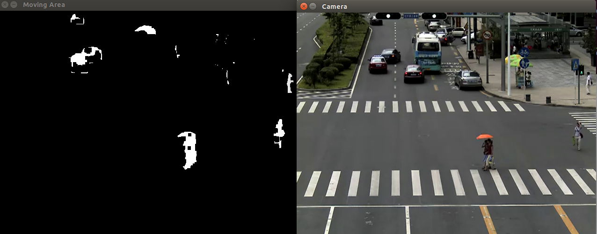
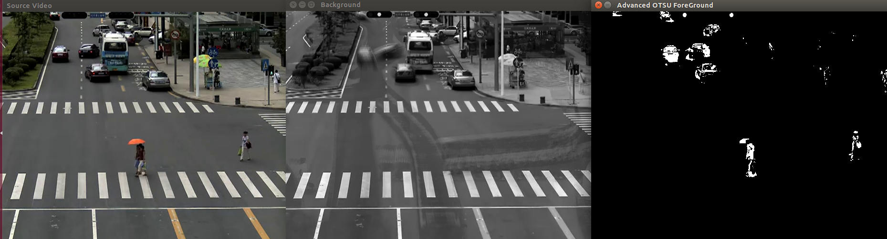
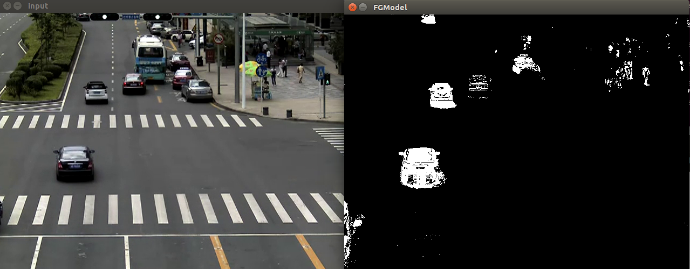
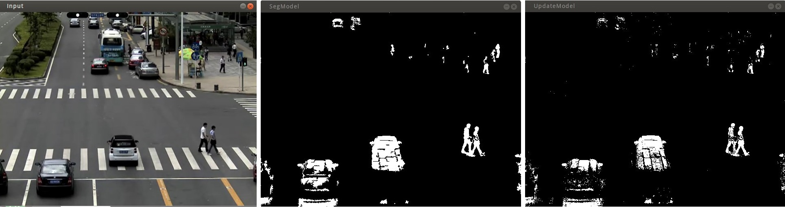

This repository is the C++ Source Code of several algorithms of Extracting Background, which are based on OpenCV libraries after I learn about the theory of these algorithms.
These **Extracting Background Algorithms** includes **Frame-Difference** Algorithm, **Background-Difference** Algorithm, **ViBe** Algorithm, **ViBe+** Algorithm.

# Extracting Background Algorithms' Theory
I wrote a blog about these algorithms' theory. And here is the web address:
[《背景提取算法——帧间差分法、背景差分法、ViBe背景提取算法》](http://blog.csdn.net/ajianyingxiaoqinghan/article/details/72628402)
[《论文翻译：ViBe+算法（ViBe算法的改进版本）》](http://blog.csdn.net/ajianyingxiaoqinghan/article/details/72782685)
The Paper of ViBe+ Algorithm's web address:
[《Background Subtraction: Experiments and Improvements for ViBe》](http://orbi.ulg.ac.be/bitstream/2268/117561/1/VanDroogenbroeck2012Background.pdf)

# Files Introduction

- src - Source Codes' Path
	- FramesDifference - source codes of Frame-Difference Algorithm
	- BGDifference - source codes of Background-Difference Algorithm
	- ViBe - source codes of ViBe Algorithm
	- ViBe+ - source codes of ViBe+ Algorithm
- Image - the Path of Screenshot of Test Programs
- Video - the Path of Test Video 
- CMakeLists.txt - CMake File of this Project

# Tutorial for Generating this Project
## 1. My Working Environment

- Operating System: Ubuntu 14.04 LTS
- Conditions before your cmake command:
	- have already done OpenCV's make & make install
	- have already done CMake's make & make install

Besides, I also wrote the tutorial blog of how to install OpenCV 2.4.9 in Ubuntu 14.04. Here are the websites: 
CSDN：http://blog.csdn.net/ajianyingxiaoqinghan/article/details/62424132
GitHub：https://github.com/upcAutoLang/Blog/issues/1

## 2. CMake this Project
Open a terminal and enter in the path of folder named *GLCM_OpenCV*, then input commands like below:
```bash
cmake ./
make
```
Then you will build this project.

The path of binary files - /BackgroundSplit-OpenCV/build/bin 
The path of library files - /BackgroundSplit-OpenCV/build/lib

# Test Results
I run these 3 kinds of Algorithms by using video whose path is */BackgroundSplit-OpenCV/Video/Camera Road 01.avi*, and 3 kinds of Algorithms' results are like below:
the result of Frame-Difference Algorithm:

the result of Background-Difference Algorithm:

the result of ViBe Algorithm:

the result of ViBe+ Algorithm:


**P.S:**
**1. Efficiency of ViBe Algorithm: **
the result of **Debug Version**:
```cpp
Time of Update ViBe Background: 15.5914ms
Time of Update ViBe Background: 15.7827ms
Time of Update ViBe Background: 15.2309ms
Time of Update ViBe Background: 15.3791ms
Time of Update ViBe Background: 16.5063ms
Time of Update ViBe Background: 16.0289ms
```
the result of **Release Version**:
```cpp
Time of Update ViBe Background: 3.88142ms
Time of Update ViBe Background: 3.71257ms
Time of Update ViBe Background: 3.59945ms
Time of Update ViBe Background: 3.35824ms
Time of Update ViBe Background: 3.57153ms
Time of Update ViBe Background: 3.44415ms
```

**2. Efficiency of ViBe+ Algorithm: **
the result of **Debug Version**:
```cpp
Time of Update ViBe+ Background: 224.118ms
Time of Update ViBe+ Background: 222.495ms
Time of Update ViBe+ Background: 223.623ms
Time of Update ViBe+ Background: 243.826ms
Time of Update ViBe+ Background: 224.687ms
Time of Update ViBe+ Background: 223.875ms
```
the result of **Release Version**:
```cpp
Time of Update ViBe+ Background: 66.9405ms
Time of Update ViBe+ Background: 67.1447ms
Time of Update ViBe+ Background: 69.6733ms
Time of Update ViBe+ Background: 68.3159ms
Time of Update ViBe+ Background: 67.0427ms
Time of Update ViBe+ Background: 75.1574ms
Time of Update ViBe+ Background: 68.5131ms
```

It shows that the amount of calculation increased and the efficiency of calculation decreased after increasing algorithm's complexity.
